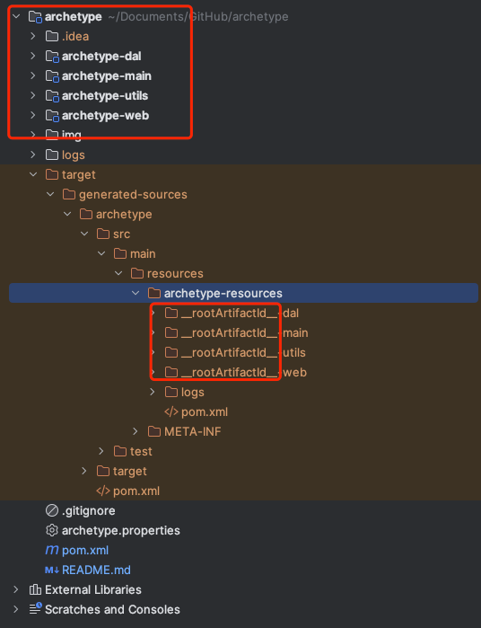
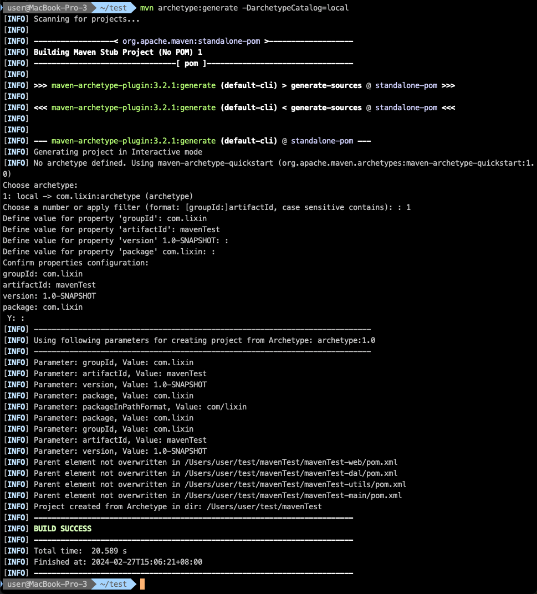
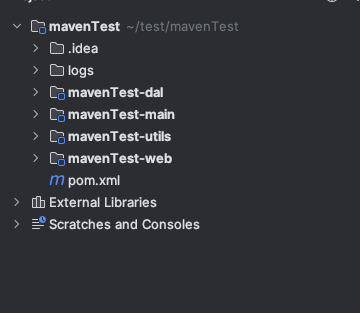

# 项目名称

maven脚手架


## 简介

Maven 脚手架是一个用于快速创建项目结构的工具。它提供了一种简单而灵活的方式来创建基于 Maven 构建的项目，使开发者能够更专注于业务逻辑的实现，而不必花费过多时间来配置项目的基础结构。

该脚手架基于一种分层架构设计，旨在帮助开发者快速构建可维护、可扩展的应用程序。它提供了以下几个核心功能：

- **项目分层结构**: 包括数据访问层（DAO）、业务逻辑层（Service）、控制器层（Controller）等，使项目结构更清晰明了。
- **集成常用库和框架**: 预先集成了常用的库和框架，简化了项目搭建过程。
- **快速配置**: 提供了一些默认的配置，同时也允许根据项目需求进行自定义配置，满足不同项目的需求。


## 开始

### 准备

确保你已经安装了以下工具：

- Maven

### 安装

1. 克隆项目到本地：

   ```bash
   https://github.com/xwang339/archetype.git
   ```

2. 进入项目目录：

   ```bash
   cd /archetype
   ```

3. 编译和安装项目：

   ```bash
   mvn clean install
   ```


## 使用示例

### 指定 Maven 的配置文件

在执行 Maven 命令时，需要指定 Maven 的配置文件，否则 Maven 会查找系统中的 `settings.xml` 文件。以下是指定配置文件 `archetype.properties` 的命令：

```bash
mvn -s /#{mavenPath}/conf/settings.xml clean archetype:create-from-project -Darchetype.properties=./archetype.properties
```

### 进入生成目录
```bash
  cd target/archetype
```
### 执行 Maven 的清理和安装命令：
```bash
mvn clean install
```

### 子模块与父模块包名相同会会占位符替代


这个时候当前脚手架就会被配置到你的settings文件中指定的maven/repository/archetype-catalog.xml

### 脚手架快速生成项目

```bash
mvn archetype:generate -DarchetypeCatalog=local
Choose archetype:
1: local -> com.lixin:archetype (archetype)
Choose a number or apply filter (format: [groupId:]artifactId, case sensitive contains): : 1 ##选择本地的脚手架如果你生成了多个脚手架他可能会有多个选择
Define value for property 'groupId': #{groupId}」 
Define value for property 'artifactId': #{artifactId} 
Define value for property 'version' #{version}
Define value for property 'package' #{package}
 Y: :  ##回车yes
```

### 当前生成图的生成流程



### 生成后的效果



这样你就可以一次性获取所有内容啦！

